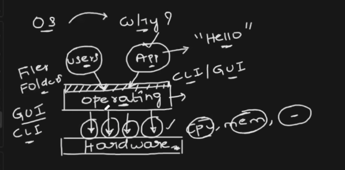
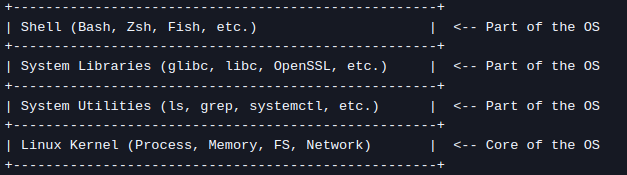
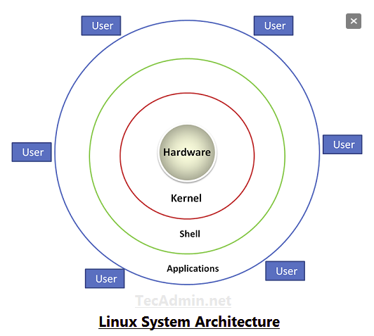

# Linux structure

# Why Operating system(OS)?
* To communicate and utilize the system hardwares by Users and Applications, operating 
  system is required. Both users and Application don't have capability to directly 
  interact with hardwares of system.

  Ex:
     1) In your application,You written one program as hello world,
     Your application can't talk directly with hardwares of system because you haven't
     written code to utilize hardwares.
     
     2) User want to create file,user can't directly interact with hardware to create 
     file,because user don't have code create file.

  Hardwares of system is CPU,RAM, motherboard, network interfaces, and peripherals.

# what is Operating System?
* Operating system is intermediate software layer,that act as brigde between 
  applications/users and hardwares of system.
* For users to interact with hardwares,OS will provide CLI and GUI.
* OS is a collection of linux kernel,the CLI(Bash, Zsh, Fish, etc.),system libraries
  (glibc, libc, OpenSSL, etc.),system utlities(ls, grep, systemctl, etc.).
* Linux kernel is core of os,is responsible for directly managing the system hardwares,
  including:

   Process Management – Schedules processes and handles multitasking.

   Memory Management – Allocates and deallocates RAM efficiently.

   Device Drivers – Acts as an interface between software and hardware.

   File System Management – Manages how data is stored and retrieved.

   Network Management – Handles communication between systems

# Linux System Architecture

(a) Hardware Layer

* The physical components of the computer (CPU, RAM, disk, network interfaces, etc.).
* The OS interacts with hardware using device drivers.

(b) Kernel (Core of Linux OS) --> Part of OS

* The Linux Kernel is responsible for directly managing system resources, including:

    Process Management – Schedules processes and handles multitasking.

    Memory Management – Allocates and deallocates RAM efficiently.

    Device Drivers – Acts as an interface between software and hardware.

    File System Management – Manages how data is stored and retrieved.

    Network Management – Handles communication between systems.

(c) Shell (Command Line Interface - CLI) --> Part of OS

* A command interpreter that allows users to interact with the kernel.
* Examples: sh, Bash, Zsh, Fish, Dash, Ksh.
* Converts user commands into system calls for the kernel.

(d) User Applications

* End-user programs like web browsers, text editors, DevOps tools, etc.
* Applications interact with the OS using system calls via the shell or GUI.

(f) Users
* Users will interact with OS using CLI. CLI will be provided by OS.

# History of Operating System:

* In 1960, unix operating system is released,before it is very difficult to application 
  developers to handle hardware interaction code in application.
  unix os is open source and solves application interaction with hardware problem.
* In 1970,minix os is release, minix is developed on top of unix and it is partially open 
  source
* In 1980,microsoft released their os called windows,unlike unix and minix os,it have 
  rich graphical user interface(GUI). GUI made easier to user to made communication with 
  hardware ,user don't need to remember commands.
* Organizations/Developers are required licence to use the Unix and Windows. 
  In 1990,linux operating system is released and developed by Linus. 
  linux OS become popular choice to organizations/developers because linux os is open 
  source,free to use,secure and have large community to continuous contribution,
  they ensure linux OS always secure.

* Nice blog about linux system architecture -->
  https://medium.com/@pragnapcu/linux-architecture-ed3ed126b58d