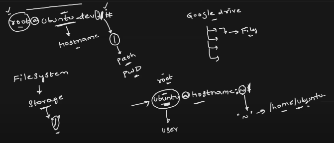

* When you login with root user into any linux system,we can see root@<hostname>:/

  * / is path and it is root path, /root is home directory for root user.

* When you login with non-root user.we can see <user>@<hostname>:~ 
   * ~ is home directory of user. All files and folder created by user go to his home directory. 

* root user have all admistrative privileges. we can create others users with limited access using root 
  user.

  

# folder structure

* /sbin --> /sbin contains the system binaries,basically that are administrative commands and 
  used to manage the system
  Ex: useradd,userdel etc commands

  /sbin is link to /usr/sbin
  
* /lib  means library --> /lib contains the libraries and used by kernel. As a user we will not use /lib.
 
   /lib is link to /usr/lib

* /boot --> /boot contains the files which helps to start or restart the linux system.
   Basicaaly commands required during start or restart linux system.

* /bin --> /bin contains the non-administrative commands,we can give access to every user.
   Ex: date,diff etc

   /bin is link to /usr/bin

* /usr means user -->  /usr contains most user-installed applications,libraries. 
  sbin,bin,lib folder are part of /usr folder.
  
* /srv  means server --> /srv Holds data for services like web servers

* /opt --> /opt is used to install the third party softwares like java
            because if we install in our home directory,we have to give access other users to use that.
            
* /mnt means mount --> /mnt is Temporary mount point to add storage into file system.

* /var --> /var is used to store log files,caches, temporary files that change frequently

* /home --> Default location for user home directories

* /data --> /data is used to store and share data with other people
            Ex: sharing file which is required by other users
  
* /proc --> /proc is Virtual filesystem for process and system information.

* /tmp --> Temporary files,cleared on reboot.

* /root --> home directory for root user.

* /etc  --> /etc contains the system configuration files, using these files we can change the configuration.
            Ex: passwd is used to change password of any user
                hosts is used to add local dsn
                os-release contains os details
                rc0,rc1 etc folders to add executables, that are priority based.

When I execute the ls or other command,how linux system get to know executable location of 
file?
Ans: there is PATH env,which contains the different paths.
     linux will check the all paths in PATH env for executable,when it found,call that executable.
      echo $PATH --> gives the paths contained in PATH env.

Difference between /sbin and /bin

* /sbin stands for system binaries
* /sbin contains the administrative commands
* grant permission to /sbin only for system admins 

* /bin stands for user binaries
* /bin contains the non-administrative commands
* grant permission to /bin for every user 

